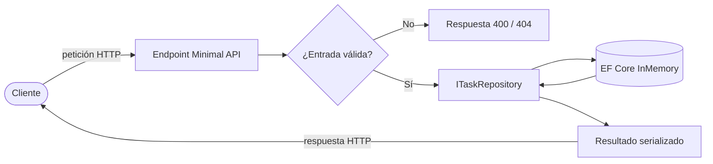

<!-- ══════════════════════════ PORTADA ══════════════════════════ -->
<div align="center">
  
</div>

<!-- ══════════════════════ IDIOMAS / LANGUAGES ══════════════════════ -->
<div align="center">
<a href="README.md"></a>
<a href="README.en.md"></a>
<a href="README.es.md"></a>
</div>

<h1 align="center">tasks-api-dotnet</h1>
<p align="center"><em>Minimal API .NET limpia y bien probada para gestión de tareas</em></p>
<p align="center"><strong>ASP.NET Core Minimal API → EF Core InMemory → xUnit</strong></p>

<div align="center">
<a href="https://github.com/geoggrigori/tasks-api-dotnet/actions/workflows/ci.yml"></a>


</div>

<div align="center">
<a href="#acerca-de"></a>
<a href="#endpoints"></a>
<a href="#flujo-de-la-petición"></a>
<a href="#uso"></a>
</div>

<br/>

> 📘 **Swagger UI incluido** — corre la API y abre `/swagger` para explorar todo interactivamente.

## Acerca de

Una **Minimal API** limpia y bien probada para gestión de tareas, construida con **ASP.NET Core**, **EF Core** y **xUnit**.

**Destacados:**
- CRUD completo de tareas vía interfaz REST.
- Filtro opcional `?done=true|false` al listar.
- Validación de entrada: títulos vacíos se rechazan con `400`.
- Semántica REST correcta: `201 Created` con header `Location`, `204 No Content` en delete, `404 Not Found` para ids desconocidos.
- Abstracción de repositorio (`ITaskRepository`) sobre el provider EF Core InMemory.
- Documentación interactiva **Swagger UI** / OpenAPI.
- Pruebas de integración con `WebApplicationFactory` cubriendo cada endpoint.

## Endpoints

| Método | Ruta | Descripción | Status |
|---|---|---|---|
| GET | `/tasks` | Lista tareas (opcional `?done=true\|false`) | `200` |
| GET | `/tasks/{id}` | Busca una tarea por id | `200`, `404` |
| POST | `/tasks` | Crea una nueva tarea | `201`, `400` |
| PUT | `/tasks/{id}` | Reemplaza una tarea existente | `200`, `400`, `404` |
| PATCH | `/tasks/{id}/toggle` | Alterna la flag `done` | `200`, `404` |
| DELETE | `/tasks/{id}` | Elimina una tarea | `204`, `404` |

## Flujo de la petición



## Uso

**Requisito:** [.NET SDK 10](https://dotnet.microsoft.com/download)

```bash
dotnet run --project src/TasksApi
```

API en `http://localhost:5080`, Swagger UI en `http://localhost:5080/swagger`.

**Ejemplos:**
```bash
# Crear (201 Created)
curl -i -X POST http://localhost:5080/tasks \
  -H "Content-Type: application/json" \
  -d '{ "title": "Buy milk" }'

# Alternar completado
curl -i -X PATCH http://localhost:5080/tasks/{id}/toggle

# Listar solo las completadas
curl "http://localhost:5080/tasks?done=true"
```

**Pruebas:**
```bash
dotnet test
```
xUnit + `Microsoft.AspNetCore.Mvc.Testing` ejercitando la API de punta a punta: creación, búsqueda, listado, filtro `done`, actualización, toggle, eliminación y validación.

**Estructura:**
```
tasks-api-dotnet/
├── src/TasksApi/            # Minimal API
│   ├── Data/                # DbContext EF Core
│   ├── Endpoints/           # Mapeo de endpoints
│   ├── Models/               # Entidad y DTOs
│   └── Repositories/         # ITaskRepository + implementación EF
└── tests/TasksApi.Tests/     # Pruebas de integración xUnit
```

## Licencia

[MIT](LICENSE).

<div align="center">
  
</div>

<p align="center"><sub>Desarrollado por <strong><a href="https://github.com/geoggrigori">Grigori</a></strong> · 2026</sub></p>
