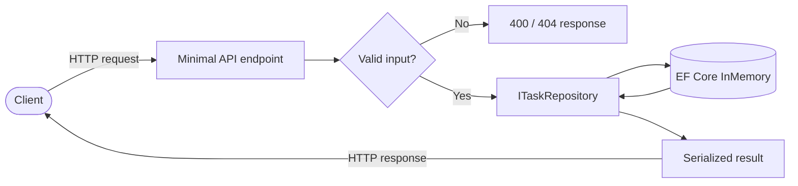

[](https://dotnet.microsoft.com/)
[](https://learn.microsoft.com/dotnet/csharp/)
[](https://swagger.io/)
[](LICENSE)

A clean, well-tested **Minimal API** for task management, built with **ASP.NET Core**, **EF Core** and **xUnit**.

## Features

- Full CRUD for tasks (todos) over a RESTful HTTP interface.
- Optional `?done=true|false` filter when listing tasks.
- Input validation: empty titles are rejected with `400`.
- Correct REST semantics: `201 Created` with a `Location` header, `204 No Content` on delete, `404 Not Found` for unknown ids.
- Repository abstraction (`ITaskRepository`) backed by the EF Core in-memory provider.
- Interactive **Swagger UI** / OpenAPI documentation.
- Integration tests with `WebApplicationFactory` covering every endpoint.

## The model

```jsonc
{
  "id": "f1c5...",        // Guid, server-generated
  "title": "Buy milk",     // string, required and non-empty
  "done": false,           // bool
  "createdAt": "2026-06-16T12:00:00Z" // UTC, server-generated
}
```

## Endpoints

| Method | Path           | Description                                   | Status codes              |
| ------ | -------------- | --------------------------------------------- | ------------------------- |
| GET    | `/tasks`       | List tasks (optional `?done=true\|false`)     | `200`                     |
| GET    | `/tasks/{id}`  | Get a single task by id                       | `200`, `404`              |
| POST   | `/tasks`       | Create a new task                             | `201`, `400`              |
| PUT    | `/tasks/{id}`  | Replace an existing task                      | `200`, `400`, `404`       |
| DELETE | `/tasks/{id}`  | Delete a task by id                           | `204`, `404`              |

## Request flow



## Getting started

### Prerequisites

- [.NET SDK 10](https://dotnet.microsoft.com/download)

### Run the API

```bash
dotnet run --project src/TasksApi
```

The API listens on `http://localhost:5080`. The Swagger UI is available at:

```
http://localhost:5080/swagger
```

## Usage examples

> The examples below assume the API is running on `http://localhost:5080`.

### Create a task — `201 Created`

```bash
curl -i -X POST http://localhost:5080/tasks \
  -H "Content-Type: application/json" \
  -d '{ "title": "Buy milk" }'
```

```http
HTTP/1.1 201 Created
Location: /tasks/3f2504e0-4f89-41d3-9a0c-0305e82c3301
Content-Type: application/json

{
  "id": "3f2504e0-4f89-41d3-9a0c-0305e82c3301",
  "title": "Buy milk",
  "done": false,
  "createdAt": "2026-06-16T12:00:00.123Z"
}
```

### Create with an empty title — `400 Bad Request`

```bash
curl -i -X POST http://localhost:5080/tasks \
  -H "Content-Type: application/json" \
  -d '{ "title": "" }'
```

```http
HTTP/1.1 400 Bad Request
Content-Type: application/problem+json

{
  "errors": {
    "title": [ "Title is required and cannot be empty." ]
  }
}
```

### List tasks — `200 OK`

```bash
curl http://localhost:5080/tasks
# Only completed tasks:
curl "http://localhost:5080/tasks?done=true"
```

```json
[
  {
    "id": "3f2504e0-4f89-41d3-9a0c-0305e82c3301",
    "title": "Buy milk",
    "done": false,
    "createdAt": "2026-06-16T12:00:00.123Z"
  }
]
```

### Get a task by id — `200 OK` / `404 Not Found`

```bash
curl http://localhost:5080/tasks/3f2504e0-4f89-41d3-9a0c-0305e82c3301
```

```http
HTTP/1.1 404 Not Found
```

### Update a task — `200 OK`

```bash
curl -i -X PUT http://localhost:5080/tasks/3f2504e0-4f89-41d3-9a0c-0305e82c3301 \
  -H "Content-Type: application/json" \
  -d '{ "title": "Buy milk", "done": true }'
```

```json
{
  "id": "3f2504e0-4f89-41d3-9a0c-0305e82c3301",
  "title": "Buy milk",
  "done": true,
  "createdAt": "2026-06-16T12:00:00.123Z"
}
```

### Delete a task — `204 No Content`

```bash
curl -i -X DELETE http://localhost:5080/tasks/3f2504e0-4f89-41d3-9a0c-0305e82c3301
```

```http
HTTP/1.1 204 No Content
```

A second delete of the same id returns `404 Not Found`.

## Running tests

```bash
dotnet test
```

The suite uses xUnit and `Microsoft.AspNetCore.Mvc.Testing` to exercise the API end to end, covering creation, retrieval, listing, the `done` filter, updates, deletion and validation.

## Project structure

```
tasks-api-dotnet/
├── src/TasksApi/            # Minimal API
│   ├── Data/                # EF Core DbContext
│   ├── Endpoints/           # Endpoint mappings
│   ├── Models/              # Entity and DTOs
│   ├── Repositories/        # ITaskRepository + EF implementation
│   └── Program.cs
└── tests/TasksApi.Tests/    # xUnit integration tests
```

## License

Released under the [MIT License](LICENSE). Copyright (c) 2026 Geovana Grigorio.
