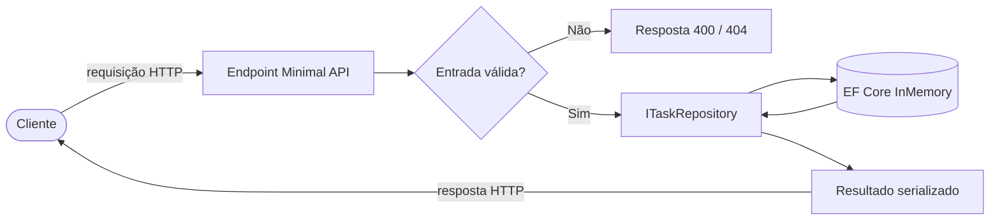

<!-- ══════════════════════════ TÍTULO ══════════════════════════ -->
<div align="center">
  
</div>

<br/>

<!-- ══════════════════════ IDIOMAS / LANGUAGES ══════════════════════ -->
<div align="center">
<a href="README.md"></a>
<a href="README.en.md"></a>
<a href="README.es.md"></a>
</div>

<br/>

<h1 align="center">tasks-api-dotnet</h1>
<p align="center"><em>Minimal API .NET limpa e bem testada para gerenciamento de tarefas</em></p>
<p align="center"><strong>ASP.NET Core Minimal API → EF Core InMemory → xUnit</strong></p>

<div align="center">
<a href="https://github.com/geoggrigori/tasks-api-dotnet/actions/workflows/ci.yml"></a>


</div>

<div align="center">
<a href="#sobre"></a>
<a href="#endpoints"></a>
<a href="#fluxo-da-requisição"></a>
<a href="#uso"></a>
</div>

<br/>

> 📘 **Swagger UI incluso** — rode a API e abra `/swagger` pra explorar tudo interativamente.

## Sobre

Uma **Minimal API** limpa e bem testada para gerenciamento de tarefas, construída com **ASP.NET Core**, **EF Core** e **xUnit**.

**Destaques:**
- CRUD completo de tarefas via interface REST.
- Filtro opcional `?done=true|false` ao listar.
- Validação de entrada: títulos vazios são rejeitados com `400`.
- Semântica REST correta: `201 Created` com header `Location`, `204 No Content` no delete, `404 Not Found` pra ids desconhecidos.
- Abstração de repositório (`ITaskRepository`) sobre o provider EF Core InMemory.
- Documentação interativa **Swagger UI** / OpenAPI.
- Testes de integração com `WebApplicationFactory` cobrindo todo endpoint.

## Endpoints

| Método | Rota | Descrição | Status |
|---|---|---|---|
| GET | `/tasks` | Lista tarefas (opcional `?done=true\|false`) | `200` |
| GET | `/tasks/{id}` | Busca uma tarefa por id | `200`, `404` |
| POST | `/tasks` | Cria uma nova tarefa | `201`, `400` |
| PUT | `/tasks/{id}` | Substitui uma tarefa existente | `200`, `400`, `404` |
| PATCH | `/tasks/{id}/toggle` | Alterna a flag `done` | `200`, `404` |
| DELETE | `/tasks/{id}` | Remove uma tarefa | `204`, `404` |

## Fluxo da Requisição



## Uso

**Pré-requisito:** [.NET SDK 10](https://dotnet.microsoft.com/download)

```bash
dotnet run --project src/TasksApi
```

API em `http://localhost:5080`, Swagger UI em `http://localhost:5080/swagger`.

**Exemplos:**
```bash
# Criar (201 Created)
curl -i -X POST http://localhost:5080/tasks \
  -H "Content-Type: application/json" \
  -d '{ "title": "Buy milk" }'

# Alternar conclusão
curl -i -X PATCH http://localhost:5080/tasks/{id}/toggle

# Listar só as concluídas
curl "http://localhost:5080/tasks?done=true"
```

**Testes:**
```bash
dotnet test
```
xUnit + `Microsoft.AspNetCore.Mvc.Testing` exercitando a API ponta a ponta: criação, busca, listagem, filtro `done`, atualização, toggle, exclusão e validação.

**Estrutura:**
```
tasks-api-dotnet/
├── src/TasksApi/            # Minimal API
│   ├── Data/                # DbContext EF Core
│   ├── Endpoints/           # Mapeamento de endpoints
│   ├── Models/               # Entidade e DTOs
│   └── Repositories/         # ITaskRepository + implementação EF
└── tests/TasksApi.Tests/     # Testes de integração xUnit
```

## Licença

[MIT](LICENSE).

<div align="center">
  
</div>

<p align="center"><sub>Desenvolvido por <strong><a href="https://github.com/geoggrigori">Grigori</a></strong> · 2026</sub></p>
